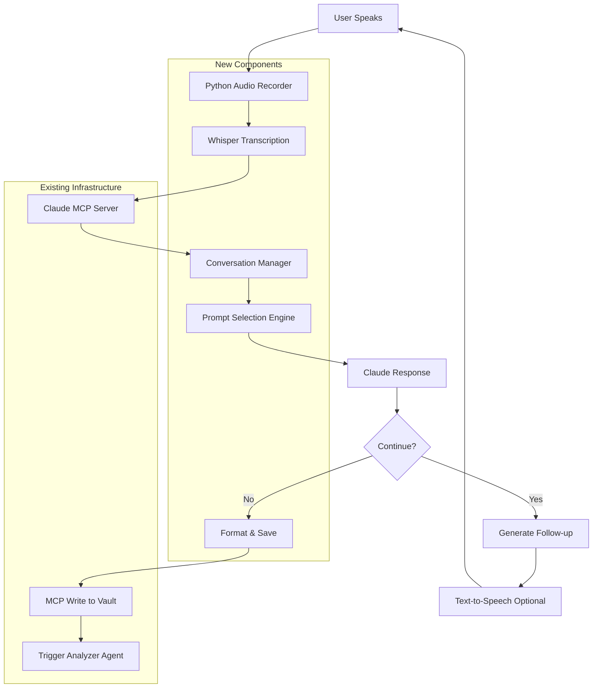

# Voice Notes Feature - Implementation Analysis & Plan

## Executive Summary

This document analyzes different technical approaches for implementing a voice notes feature for the Insight Engine, evaluating pros/cons and recommending the optimal solution that leverages existing infrastructure.

## Feature Requirements Analysis

### Core Requirements
1. **Voice Recording**: Capture thoughts and insights via audio
2. **Transcription**: Convert voice to text automatically  
3. **AI Conversation**: Cofounder-like AI that prompts deeper thinking
4. **Vault Integration**: Save as markdown files in `Content Bank/1-raw-ideas/`
5. **MCP Integration**: Leverage existing MCP server infrastructure
6. **Zero Additional Cost**: Use existing tools and infrastructure

### User Experience Goals
- Minimal friction between thought and capture
- Natural conversation flow with AI prompts
- Automatic organization and tagging
- Seamless integration with existing Insight Engine workflow

## Technical Implementation Options

### Option 1: Python Desktop App with MCP Integration ⭐ RECOMMENDED

**Architecture:**
```
Voice Input → Python App → Whisper Transcription → Claude Processing → MCP Server → Obsidian Vault
```

**Implementation Details:**
- **Recording**: Python with `sounddevice` library for cross-platform audio
- **Transcription**: OpenAI Whisper (local model or API)
- **AI Processing**: Claude via existing MCP server
- **Storage**: Direct file write via MCP tools

**Pros:**
✅ Leverages existing MCP infrastructure perfectly
✅ Can run locally with Whisper model (no API costs)
✅ Full control over conversation flow
✅ Easy to integrate with existing Analyzer/Connector agents
✅ Can be triggered via hotkey or command line

**Cons:**
❌ Requires Python environment setup
❌ Desktop-only (not mobile)
❌ Initial setup complexity

**Cost:** $0 (using local Whisper model) or minimal (Whisper API ~$0.006/minute)

---

### Option 2: Browser-Based Web App

**Architecture:**
```
Browser Mic → Web Audio API → Speech Recognition → Claude API → MCP Server → Obsidian
```

**Implementation Details:**
- **Recording**: Web Audio API with MediaRecorder
- **Transcription**: Browser SpeechRecognition API or external service
- **Interface**: Simple HTML/JS app served locally
- **Backend**: FastAPI server connecting to MCP

**Pros:**
✅ Works on any device with browser
✅ No installation required
✅ Modern, familiar UX

**Cons:**
❌ Requires running local web server
❌ Browser speech recognition less accurate
❌ More complex architecture

**Cost:** $0 with browser API, or API costs for better transcription

---

### Option 3: Obsidian Plugin

**Architecture:**
```
Obsidian Plugin → Recording API → Transcription Service → Claude MCP → Vault
```

**Implementation Details:**
- **Plugin**: TypeScript Obsidian plugin
- **Recording**: Obsidian audio recording API
- **Integration**: Plugin calls MCP server endpoints

**Pros:**
✅ Native Obsidian integration
✅ Best user experience
✅ No external apps needed

**Cons:**
❌ Complex plugin development
❌ Maintenance overhead
❌ Obsidian API limitations
❌ Longer development time

**Cost:** $0 + significant development time

---

### Option 4: Mobile App + File Sync

**Architecture:**
```
iOS/Android Voice Memos → Dropbox/iCloud → File Watcher → MCP Processing → Obsidian
```

**Implementation Details:**
- **Recording**: Native voice memo apps
- **Sync**: Cloud storage auto-sync
- **Processing**: Python watcher script

**Pros:**
✅ Mobile-first experience
✅ Uses existing apps
✅ Works offline

**Cons:**
❌ No real-time AI conversation
❌ Sync delays
❌ Platform-specific setup
❌ Less integrated experience

**Cost:** $0 (using existing cloud storage)

---

## Recommended Solution: Python Desktop App with MCP

### Why This Solution?

1. **Leverages Existing Infrastructure**: Direct integration with your MCP server means no new architecture
2. **Cost Effective**: Can use local Whisper model for $0 operational cost
3. **Rapid Development**: Can prototype in days, not weeks
4. **Extensible**: Easy to add features like hotkeys, scheduling, multi-modal input
5. **AI-Native**: Built specifically for Claude conversation flow

### Implementation Architecture



### Key Features

#### 1. Smart Conversation Flow
```python
class ConversationManager:
    def __init__(self):
        self.prompts = {
            'startup': load_prompts('low-effort-prompts.md'),
            'deep_dive': load_prompts('weekly-founder-journal.md'),
            'metrics': load_prompts('metrics.md')
        }
        self.context = []
        
    def get_next_prompt(self, transcript, topics):
        # Intelligently select next prompt based on:
        # - Current topics being discussed
        # - Conversation depth
        # - User energy level
        # - Time constraints
```

#### 2. Voice Note Format
```markdown
---
claude_analysis:
  topics: ["customer feedback", "product iteration", "churn"]
  type: "insight"
  entities: ["UserX", "Feature Y"]
  recording_date: "2025-01-10"
  duration: "5:23"
  conversation_depth: 3
---

# Voice Note: Rethinking Our Onboarding Flow

## Key Insight
[Main realization from the conversation]

## Context
*Recorded during: Morning walk*
*Prompted by: Customer cancellation email*

## Conversation Flow

**Initial Thought:**
[First unprompted thoughts]

**AI Prompt: "What did you avoid working on this week?"**
[Response and elaboration]

**AI Follow-up: "What would happen if you fixed that tomorrow?"**
[Deeper exploration]

## Action Items
- [ ] Item extracted from conversation
- [ ] Another action

## Connected Ideas
- [[Previous insight about onboarding]]
- [[Customer feedback from last week]]

---
*Auto-generated from voice conversation - Duration: 5:23*
```

### Implementation Phases

#### Phase 1: Basic Recording & Transcription (Week 1)
- Set up Python audio recording with sounddevice
- Integrate Whisper for transcription (local tiny model for speed)
- Basic CLI interface for start/stop recording
- Save raw transcriptions to vault

#### Phase 2: AI Conversation Integration (Week 2)
- Connect to Claude MCP server
- Implement conversation manager
- Add prompt selection logic
- Create conversation templates

#### Phase 3: Smart Processing & Organization (Week 3)
- Auto-generate YAML frontmatter
- Extract action items and key insights
- Create wikilinks to related notes
- Integrate with existing Analyzer agent

#### Phase 4: Enhanced UX & Automation (Week 4)
- Add system tray app for quick access
- Implement hotkey triggers
- Add voice activity detection
- Optional text-to-speech for AI responses

---

## Alternative Quick Start: Hybrid Approach

If you want to start testing immediately with minimal setup:

### Quick Prototype Stack
1. **Recording**: Use QuickTime/Voice Memos (manual)
2. **Transcription**: OpenAI Whisper API via Python script
3. **Processing**: Claude conversation via your MCP
4. **Output**: Formatted markdown to vault

This lets you validate the workflow before building the full automated system.

```python
# quick_voice_note.py
import whisper
from pathlib import Path
import requests

def process_voice_file(audio_path):
    # Transcribe
    model = whisper.load_model("base")
    result = model.transcribe(audio_path)
    
    # Send to Claude MCP for processing
    response = mcp_client.process_voice_note(
        transcript=result["text"],
        prompt_style="conversational"
    )
    
    # Save to vault
    save_to_obsidian(response)
```

---

## Risk Mitigation

### Technical Risks
1. **Whisper accuracy**: Mitigated by using medium/large models for important notes
2. **MCP integration complexity**: Already proven with existing agents
3. **Audio quality issues**: Add noise cancellation preprocessing

### User Experience Risks
1. **Adoption friction**: Mitigated by simple hotkey activation
2. **Conversation quality**: Continuously tune prompts based on usage
3. **Processing delays**: Use async processing with status indicators

---

## Success Metrics

### Week 1 Success
- Successfully record and transcribe 5 voice notes
- Average transcription accuracy >90%
- Notes saved to correct vault location

### Month 1 Success  
- 20+ voice notes captured
- Average conversation depth of 3+ exchanges
- 50% of notes generate valuable wikilinks

### Month 3 Success
- Voice notes become primary capture method
- Weekly journal drafts include 3+ voice note insights
- Time from thought to note <30 seconds

---

## Next Steps

1. **Validate Technical Approach**: Test Whisper transcription quality with your voice
2. **Create Proof of Concept**: Build minimal recording + transcription script
3. **Design Conversation Flows**: Map out AI prompting strategies
4. **Build MVP**: Implement Phase 1 in Python with MCP integration
5. **Iterate Based on Usage**: Refine prompts and flow based on real usage

---

## Recommendation Summary

**Go with the Python Desktop App approach because:**
- ✅ Fastest time to value (1-2 weeks to MVP)
- ✅ Leverages ALL your existing MCP infrastructure
- ✅ Zero operational costs with local models
- ✅ Maximum control and customization
- ✅ Can evolve into more sophisticated solution

**Start with the Quick Prototype to:**
- Validate the conversation flow
- Test transcription quality
- Refine prompt engineering
- Build muscle memory for voice capture

This approach gives you the best balance of implementation speed, quality, and integration with your existing Insight Engine ecosystem.