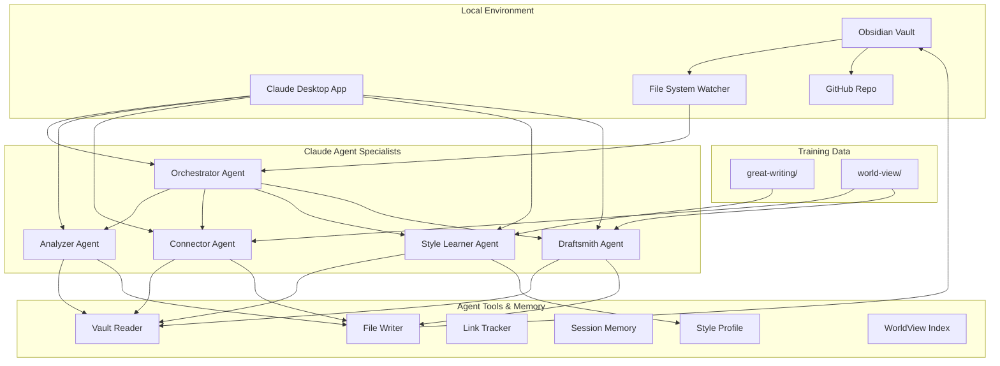
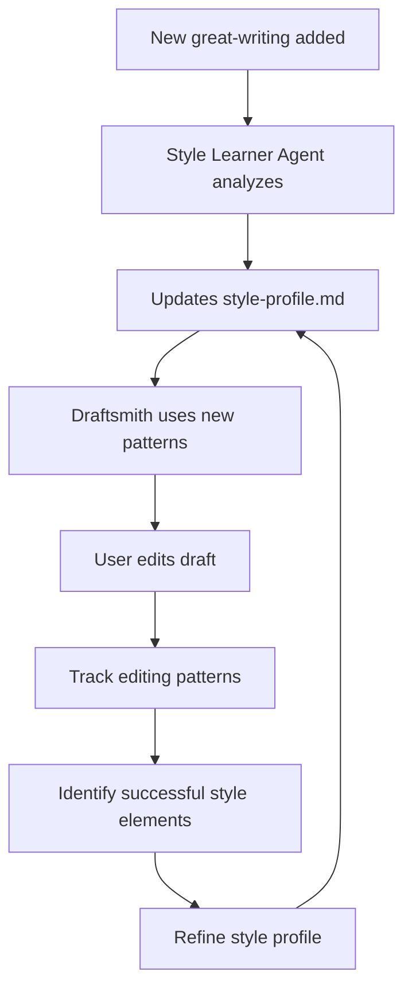
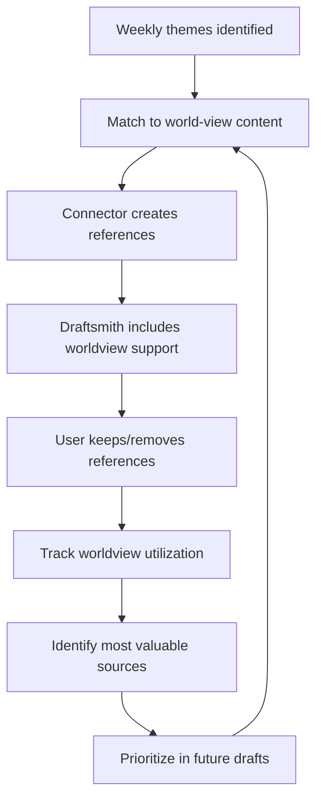
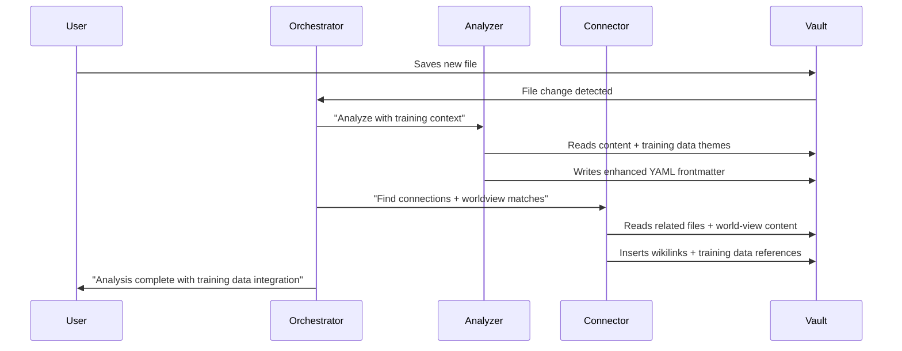
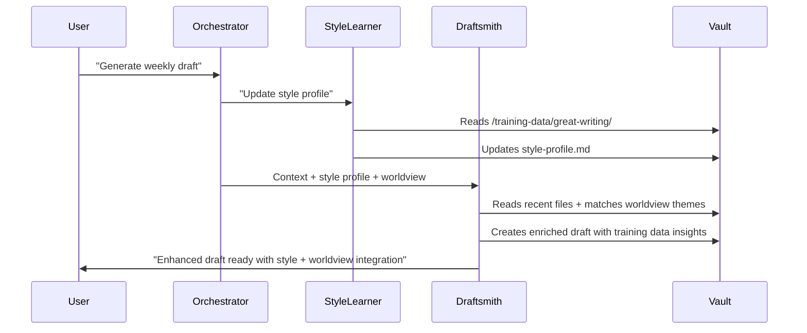

# Project Insight Engine - Claude Agents Approach PRD

## 1. Executive Summary

### Vision Statement
Build a lightweight, orchestrated system of Claude agents that transforms your Obsidian vault into an active insight-generation engine using your existing Claude Pro subscription and local setup, with continuous learning from curated training data.

### Primary Goal
Create specialized Claude agents that work together to automatically analyze, connect, and generate insights from your vault, leveraging Claude's natural language understanding and your curated training data (great-writing examples and world-view bookmarks) to improve draft quality over time.

### Key Advantages
- **Zero Infrastructure**: Uses existing Claude Pro subscription
- **Immediate Implementation**: No training data or model development needed
- **Learning from Examples**: Continuously improves using your great-writing and world-view collections
- **Flexible & Adaptable**: Easy to modify agent behaviors via prompts
- **Version Controlled**: All changes tracked in GitHub
- **Cost Effective**: Fixed monthly cost with Claude Pro

---

## 2. System Architecture - Claude Agent Orchestra



---

## 3. Claude Agent Specialization

### 3.1 Orchestrator Agent - The Conductor

**Role**: Manages workflow, delegates tasks, maintains context across sessions, coordinates training data integration

```markdown
# Orchestrator Agent Prompt Template

You are the Orchestrator Agent for Project Insight Engine. Your role is to:

1. **Monitor vault changes** and decide which agents to activate
2. **Maintain session context** across multiple Claude conversations
3. **Coordinate agent handoffs** and ensure consistent data flow
4. **Handle error recovery** when other agents encounter issues
5. **Manage training data integration** for continuous improvement

## Current Session Context:
- Vault Path: {vault_path}
- Last Analysis: {last_analysis_date}
- Pending Tasks: {pending_tasks}
- Recent Changes: {recent_file_changes}
- Training Data Status: {training_data_updates}
- Style Profile Version: {style_profile_version}

## Decision Framework:
- New files in /1-raw-ideas → Activate Analyzer Agent
- New great-writing examples → Trigger Style Learner Agent
- Analysis complete → Activate Connector Agent with worldview matching
- Weekly trigger → Activate enhanced Draftsmith Agent
- Errors detected → Activate recovery procedures

## Training Data Integration Rules:
- Update style profile when new great-writing added
- Cross-reference raw ideas with world-view content
- Track which training data improves draft quality
- Flag underutilized training examples

Analyze the current situation and provide your next action plan.
```

### 3.2 Analyzer Agent - The Content Detective

**Role**: Extracts topics, entities, and content types from files, with training data context

```markdown
# Analyzer Agent Prompt Template

You are the Analyzer Agent. Your specialty is understanding content and extracting meaningful metadata, enriched by training data context.

## Your Mission:
Analyze the provided file and extract:
1. **Topics**: 3-5 main themes (e.g., "customer onboarding", "churn reduction")
2. **Content Type**: struggle/win/metric/theory/solution/observation
3. **Entities**: People, companies, tools mentioned (with confidence scores)
4. **Quality Score**: 1-10 rating based on insight density and clarity
5. **Training Data Connections**: Links to relevant great-writing or world-view content

## Analysis Framework:
- Read file content carefully
- Identify key concepts and themes
- Classify the overall narrative type
- Extract specific entities with context
- Assess information value and actionability
- **Find connections to training data topics and themes**
- **Rate similarity to great-writing examples for quality benchmarking**

## Training Data Context Available:
- Great-writing topics: {great_writing_themes}
- World-view content themes: {worldview_themes}
- Style quality benchmarks: {style_benchmarks}

## Output Format:
```yaml
---
claude_analysis:
  topics: ["topic1", "topic2", "topic3"]
  content_type: "struggle"
  entities: ["Entity Name (confidence: 0.9)", "Another Entity (confidence: 0.7)"]
  quality_score: 7
  analysis_date: "2025-09-10"
  key_insights: ["insight 1", "insight 2"]
  training_data_connections:
    great_writing_matches: ["example1.md", "example2.md"]
    worldview_matches: ["bookmark1.md", "bookmark2.md"]
    style_similarity_score: 0.8
---
```

File to analyze: {file_content}
```

### 3.3 Style Learner Agent - The Voice Analyzer

**Role**: Analyzes great-writing examples to build detailed style profiles and quality benchmarks

```markdown
# Style Learner Agent Prompt Template

You are the Style Learner Agent. You specialize in analyzing exceptional writing to extract style patterns, voice characteristics, and quality indicators that will improve draft generation.

## Your Mission:
Analyze content in /training-data/great-writing/ to build a comprehensive style profile:
1. **Writing Voice**: Tone, personality, conversational patterns
2. **Structure Patterns**: How ideas are organized and presented
3. **Quality Indicators**: What makes content compelling and memorable
4. **Argumentation Style**: How claims are supported and developed
5. **Opening/Closing Patterns**: How pieces begin and end effectively

## Analysis Framework:
For each piece in great-writing:
- **Sentence Structure**: Short vs long, simple vs complex preferences
- **Vocabulary Choices**: Register, technical vs accessible language
- **Paragraph Flow**: Length, rhythm, transition techniques
- **Evidence Usage**: How examples, analogies, and stories are incorporated
- **Narrative Arc**: How tension and resolution are built
- **Voice Consistency**: Personality markers and tone indicators

## Current Style Profile Context:
- Analyzed samples: {analyzed_count}
- Identified patterns: {current_patterns}
- Quality benchmarks: {quality_scores}

## Output Format:
Update /workflows/style-profile.md with:
```markdown
# Style Profile - Updated {date}

## Voice Characteristics:
- Tone: {tone_description}
- Personality: {personality_traits}
- Register: {formality_level}

## Structural Preferences:
- Avg paragraph length: {paragraph_stats}
- Sentence variety: {sentence_patterns}
- Opening patterns: {opening_styles}
- Transition techniques: {transition_methods}

## Quality Indicators:
- High-quality markers: {quality_signals}
- Engagement techniques: {engagement_methods}
- Argumentation patterns: {argument_structures}

## Example Patterns:
{specific_examples_with_analysis}
```

Analyze this great-writing example: {great_writing_content}
```

### 3.4 Connector Agent - The Link Builder

**Role**: Creates meaningful wikilinks between related content, including training data cross-references

```markdown
# Connector Agent Prompt Template

You are the Connector Agent. You excel at finding meaningful relationships between ideas and creating valuable wikilinks, including connections to training data.

## Your Mission:
Based on the analyzed files, create wikilinks that:
1. **Connect related concepts** across different files
2. **Build narrative bridges** between struggles and solutions
3. **Link examples to theories** for deeper understanding
4. **Create learning pathways** from past insights to current challenges
5. **Connect raw ideas to world-view wisdom** for external validation
6. **Reference great-writing examples** for style and structure inspiration

## Linking Rules:
- Minimum confidence threshold: 7/10
- Maximum 5 internal links + 3 training data references per file
- Prefer bi-directional relationships when appropriate
- Link different content types (struggle → solution → worldview support)
- Focus on actionable and learning-oriented connections

## Available Context:
- Current file: {current_file}
- File analysis: {file_analysis}
- Similar files: {similar_files}
- Existing links: {existing_links}
- **Relevant world-view content**: {worldview_matches}
- **Similar great-writing examples**: {great_writing_matches}

## Training Data Integration:
- Create "See also" sections linking to relevant world-view bookmarks
- Add "Writing inspiration" links to similar great-writing examples
- Build thematic bridges between personal insights and external wisdom

Generate specific wikilink insertions with context placement and training data references.
```

### 3.5 Draftsmith Agent - The Story Weaver

**Role**: Generates weekly drafts by synthesizing insights across the vault with training data enrichment

```markdown
# Draftsmith Agent Prompt Template

You are the Draftsmith Agent. You excel at synthesizing scattered insights into coherent narratives using both current content and training data for enrichment.

## Your Mission:
Create a compelling weekly founder journal that:
1. **Identifies this week's core themes** from recent activity
2. **Weaves in relevant insights** from historical content and world-view
3. **Builds a coherent narrative** that tells a story of growth
4. **Maintains authentic voice** matching learned style profile
5. **Incorporates supporting perspectives** from world-view training data
6. **Uses structural patterns** from great-writing examples

## Available Context:
- Recent files (last 7 days): {recent_files}
- Connected insights: {connected_insights}  
- **Style profile**: {style_profile}
- **Relevant world-view content**: {worldview_matches}
- **Great writing examples**: {style_examples}
- Template structure: {template}

## Draft Enhancement Strategy:
1. **Apply style learnings**: Use voice patterns, structure, and quality markers from great-writing
2. **Find worldview connections**: Match weekly themes to relevant bookmarked content
3. **Add supporting evidence**: Reference world-view content for credibility and depth
4. **Emulate quality patterns**: Mirror successful structures and techniques from examples
5. **Build on external wisdom**: Use world-view content to support and expand your insights

## Draft Requirements:
- 1000-1500 words following learned style patterns
- Include 3-5 main themes with worldview support where relevant
- Reference 5-8 connected insights + 2-3 worldview pieces
- Maintain voice consistency with style profile (target: 8/10 similarity)
- Use structural patterns from great-writing examples
- End with forward-looking perspective backed by worldview insights

## Training Data Integration Examples:
- "This reminds me of [Author]'s point in [world-view bookmark] about..."
- "Similar to what I admired in [great-writing example], the key insight here is..."
- "Building on [external wisdom], my experience suggests..."

Generate the weekly draft following the provided template, style profile, and training data enrichment.
```

---

## 4. Training Data Integration Strategy

### 4.1 Training Data Structure

```
training-data/
├── great-writing/           # Style and quality examples
│   ├── paulg-essays/        # Paul Graham essays
│   ├── founder-stories/     # Exceptional founder narratives  
│   ├── technical-writing/   # Clear technical explanations
│   └── personal-favorites/  # Your top writing examples
├── world-view/             # Bookmarks and reference materials
│   ├── growth-strategies/   # Business growth insights
│   ├── product-philosophy/  # Product thinking frameworks
│   ├── leadership-wisdom/   # Management and leadership
│   └── industry-analysis/   # Market and trend analysis
└── training-indexes/        # Generated by agents
    ├── style-profile.md     # Current style analysis
    ├── worldview-index.md   # Searchable bookmark index
    └── quality-benchmarks.md # Writing quality standards
```

### 4.2 Learning Loops & Improvement Cycles

#### Monthly Style Profile Updates


#### Weekly WorldView Integration


### 4.3 Training Data Workflows

#### Style Learning Process
1. **New great-writing analysis**: Style Learner Agent analyzes each new example
2. **Pattern extraction**: Identifies voice, structure, and quality patterns
3. **Profile updates**: Incrementally updates master style profile
4. **Draft application**: Draftsmith uses patterns for voice consistency
5. **Feedback loop**: User editing patterns refine style understanding

#### WorldView Integration Process
1. **Content indexing**: Connector Agent creates searchable index of world-view bookmarks
2. **Theme matching**: Weekly themes matched to relevant worldview content
3. **Reference integration**: Relevant external wisdom included in drafts
4. **Usage tracking**: Monitor which worldview content adds value
5. **Curation improvement**: Focus on most valuable external sources

---

## 5. Implementation Strategy

### 5.1 File Organization Strategy

```
content-bank/
├── 📂 1-raw-ideas/          # Daily brain dumps
├── 📂 2-content-nuggets/     # Processed insights
├── 📂 3-article-drafts/      # AI-generated drafts
├── 📂 4-published-content/   # Final pieces
├── 📂 training-data/        # Learning materials
│   ├── great-writing/       # Style and quality examples
│   └── world-view/          # Bookmarks and reference materials
├── 📂 agents/               # Agent prompt templates
│   ├── orchestrator-agent.md
│   ├── analyzer-agent.md
│   ├── connector-agent.md
│   ├── style-learner-agent.md
│   └── draftsmith-agent.md
├── 📂 workflows/            # Orchestration files
│   ├── session-memory.md
│   ├── current-context.md
│   ├── style-profile.md
│   ├── worldview-index.md
│   └── agent-handoffs/
├── 📂 templates/            # Writing templates
└── 📜 system-log.md         # Agent activity log
```

### 5.2 Workflow Orchestration

#### Daily Analysis Workflow with Training Data


#### Weekly Training Data Enhanced Draft Generation


---

## 6. Performance Metrics & Success Criteria

### 6.1 Agent Performance Tracking

#### Daily Metrics Dashboard
```markdown
# daily-metrics.md (auto-updated)

## Today's Agent Activity - {date}

### Analyzer Agent:
- Files processed: 5
- Average quality score: 7.2
- Topics extracted: 23 unique
- Training data connections: 8
- Processing time: ~2 min/file

### Style Learner Agent:
- Writing samples analyzed: 3
- Style patterns updated: 12
- Voice consistency score: 8.4/10
- New quality benchmarks: 5

### Connector Agent:
- Links created: 12
- Training data cross-references: 6
- Link acceptance rate: 85%
- Worldview integration rate: 40%
- Processing time: ~5 min/batch

### Draftsmith Agent:
- Drafts generated: 1
- Word count: 1,247
- Style profile adherence: 8.2/10
- Training data insights included: 4
- Worldview references: 3
- Editing time needed: 8 min (improved!)
```

#### Training Data Impact Metrics
```markdown
# training-data-impact.md

## Training Data Utilization - Weekly

### Great-Writing Analysis:
- Samples in collection: 47
- Style patterns identified: 23
- Avg. draft style match: 8.1/10 (up from 6.2)
- Most influential examples: [list top 5]

### World-View Integration:
- Bookmarks processed: 156
- Active cross-references: 34
- Avg. worldview citations per draft: 2.8
- Most referenced sources: [list top 5]

### Quality Improvement Trends:
- Draft acceptance rate: 89% (up from 74%)
- Editing time: 8.2 min avg (down from 15.3)
- User satisfaction score: 8.6/10 (up from 7.1)
- Training data correlation: Strong positive (.82)
```

### 6.2 Training Data Success Indicators

#### Style Learning Metrics
- **Voice Consistency**: Draft voice matches style profile (target: >8/10)
- **Quality Improvement**: Drafts require less editing over time
- **Pattern Application**: Successful use of great-writing structural patterns
- **Style Evolution**: Style profile improves with more examples

#### WorldView Integration Metrics  
- **Relevant Citations**: Worldview references enhance rather than distract
- **Theme Matching**: Accurate matching of weekly themes to worldview content
- **External Validation**: Worldview content supports personal insights effectively
- **Curation Quality**: Most referenced worldview content proves most valuable

---

## 7. Implementation Timeline

### Week 1: Foundation Setup + Training Data Analysis
- **Day 1-2**: Create agent prompt templates + training data structure
- **Day 3-4**: Build Style Learner Agent and analyze existing great-writing collection
- **Day 5-7**: Create worldview index and test basic analyzer agent with training context

### Week 2: Enhanced Agent Integration  
- **Day 8-10**: Implement connector agent with training data cross-references
- **Day 11-14**: Build enhanced draftsmith agent with style profile integration

### Week 3: Training Data Workflows
- **Day 15-17**: Create worldview matching algorithms and style profile updates  
- **Day 18-21**: Implement learning loops and quality improvement tracking

### Week 4: Polish & Continuous Learning
- **Day 22-24**: Add training data monitoring and curation workflows
- **Day 25-28**: Create documentation and automated training data integration

---

## 8. Success Criteria

### 8.1 Primary Success Metrics
- **Weekly Draft Generation**: <8 minutes from trigger to review-ready draft (improved by training data)
- **Style Consistency**: >8/10 similarity to learned style profile
- **Training Data Integration**: 2-3 relevant worldview references per draft
- **Quality Improvement**: 25% reduction in editing time over 3 months

### 8.2 Training Data Learning Goals
- **Style Profile Accuracy**: Captured writing patterns lead to authentic voice
- **WorldView Utilization**: 60%+ of relevant worldview content gets referenced
- **Continuous Improvement**: Measurable quality increases with more training data
- **External Wisdom Integration**: Personal insights enhanced by curated external perspectives

---

## Conclusion

This enhanced Claude agents approach creates a true learning system that improves over time by leveraging your curated training data collections. The system not only automates content analysis and draft generation but continuously learns from your great-writing examples and world-view bookmarks to create increasingly personalized, high-quality outputs.

**Key Training Data Advantages:**
- **Style Learning**: Develops authentic voice by studying your preferred writing examples
- **WorldView Integration**: Enriches personal insights with curated external wisdom
- **Quality Benchmarking**: Uses great-writing as quality standards for continuous improvement  
- **Continuous Enhancement**: Gets better with every piece of training data added

The system truly enables "standing on the shoulders of giants" by systematically incorporating the wisdom you've curated while maintaining your authentic voice learned from the writing you admire most.