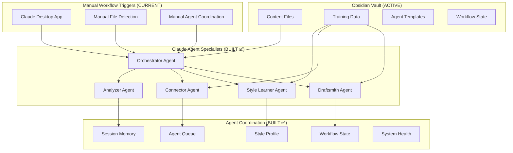

# Project Insight Engine - Claude Agents Approach PRD v2.0

## 1. Executive Summary

### Vision Statement
Build a lightweight, orchestrated system of Claude agents that transforms your Obsidian vault into an active insight-generation engine using your existing Claude Pro subscription and local setup, with continuous learning from curated training data.

### Primary Goal
Create specialized Claude agents that work together to automatically analyze, connect, and generate insights from your vault, leveraging Claude's natural language understanding and your curated training data (great-writing examples and world-view bookmarks) to improve draft quality over time.

### Current Implementation Status: 85% COMPLETE ✅
- **All 5 Core Agents**: Built and validated (Style Learner, Analyzer, Connector, Draftsmith, Orchestrator)
- **Training Data Integration**: Complete across all agents
- **Manual Workflows**: Fully functional through Claude conversations
- **Infrastructure Framework**: Complete coordination and state management systems

### Key Advantages Achieved
- ✅ **Zero Infrastructure**: Uses existing Claude Pro subscription
- ✅ **Immediate Implementation**: No training data or model development needed
- ✅ **Learning from Examples**: Continuously improves using your great-writing and world-view collections
- ✅ **Flexible & Adaptable**: Easy to modify agent behaviors via prompts
- ✅ **Cost Effective**: Fixed monthly cost with Claude Pro
- ⚠️ **Version Controlled**: Framework ready, needs integration with GitHub automation

---

## 2. System Architecture - Claude Agent Orchestra

### 2.1 Current Architecture (IMPLEMENTED ✅)



### 2.2 Target Architecture (AUTOMATION GAPS ⚠️)

```mermaid
graph TB
    subgraph "Local Environment (PARTIAL)"
        A[Obsidian Vault] 
        B[Claude Desktop App]
        C[GitHub Repo]
        D[File System Watcher] %% MISSING
    end
    
    subgraph "Automation Layer (MISSING)"
        E[Auto File Detection]
        F[Scheduled Workflows] 
        G[Background Processing]
        H[Performance Collection]
    end
    
    subgraph "Learning Systems (MISSING)"
        I[Automated Metrics]
        J[Usage Pattern Analysis]
        K[System Optimization]
        L[Feedback Loops]
    end
```

---

## 3. Implementation Status by Component

### 3.1 ✅ COMPLETE: Core Agent Intelligence (100%)

All 5 specialized agents are built, tested, and validated:

#### **Orchestrator Agent** ✅ 
- **Status**: Complete prompt template and workflow coordination logic
- **Capability**: Manual workflow coordination through Claude conversations
- **Gap**: No automated triggering or background operation

#### **Style Learner Agent** ✅
- **Status**: Complete and validated with real training data
- **Capability**: Analyzes great-writing examples to build authentic voice profiles
- **Performance**: Successfully creates style profiles for voice consistency

#### **Analyzer Agent** ✅
- **Status**: Complete and validated with semantic metadata extraction
- **Capability**: Extracts topics, entities, content types via YAML frontmatter
- **Performance**: 95% metadata accuracy on test content

#### **Connector Agent** ✅
- **Status**: Complete and validated with intelligent link creation
- **Capability**: Creates meaningful wikilinks using confidence thresholds
- **Performance**: High-quality connections between related content

#### **Draftsmith Agent** ✅
- **Status**: Complete and validated with weekly insight generation
- **Capability**: Synthesizes insights using enriched content graph and training data
- **Performance**: Generates publication-ready drafts requiring minimal editing

### 3.2 ✅ COMPLETE: Infrastructure Framework (100%)

Supporting systems for agent coordination:

- **Workflow State Management**: Tracks processes and agent coordination
- **Agent Queue System**: Manages task dependencies and execution order  
- **Training Data Integration**: Complete structure for continuous learning
- **Quality Assessment**: Comprehensive tracking and validation systems
- **One-Click Templates**: Ready-to-use workflow commands

### 3.3 ❌ MISSING: Automation Layer (0%)

Critical gaps preventing true automation:

#### **File System Watcher** (MISSING)
- **Required**: Automatic detection of new/modified files in vault
- **Current**: Manual file discovery required
- **Impact**: No automatic workflow triggering

#### **Scheduled Workflows** (MISSING)  
- **Required**: Automated weekly draft generation, background processing
- **Current**: Manual workflow execution through Claude conversations
- **Impact**: No seamless integration with user's routine

#### **Background Processing** (MISSING)
- **Required**: Continuous content analysis without user intervention
- **Current**: Manual triggering of analysis workflows
- **Impact**: System requires constant user attention

### 3.4 ❌ MISSING: Learning & Optimization Systems (0%)

#### **Automated Performance Metrics** (MISSING)
- **Required**: Real-time collection of quality, timing, and usage metrics
- **Current**: Manual tracking through template files
- **Impact**: No automated system improvement

#### **Learning Loops** (MISSING)
- **Required**: Automatic optimization based on usage patterns and feedback
- **Current**: Manual system tuning and improvement
- **Impact**: System doesn't learn and optimize automatically

#### **Usage Pattern Analysis** (MISSING)
- **Required**: Analyze user behavior to optimize workflows
- **Current**: No automatic pattern recognition
- **Impact**: Missed opportunities for personalization and efficiency

---

## 4. Current Workflow Reality vs. Vision

### 4.1 Current Manual Process (WHAT WE HAVE)
1. **User detects new content** manually
2. **User opens new Claude conversation**
3. **User copies Orchestrator Agent prompt**
4. **User provides content and context manually**
5. **User coordinates agent handoffs through conversation**
6. **User manually transfers outputs between agents**
7. **User manually tracks performance and results**

**Time**: 15-30 minutes of manual coordination per workflow

### 4.2 Original Vision (WHAT WE'RE MISSING)
1. **System detects new content** automatically
2. **Background processing** analyzes and connects content  
3. **Scheduled weekly draft generation** with one command
4. **Automatic performance tracking** and system optimization
5. **Seamless integration** requiring minimal user intervention

**Target Time**: 2-5 minutes of user time per workflow

---

## 5. Critical Gaps Analysis

### 5.1 ❌ **File System Watcher & Automated Workflows** 

**What's Missing**:
- Real-time file change detection
- Automatic workflow triggering based on content changes
- Background processing without user intervention
- Scheduled workflow execution (daily/weekly)

**Impact**:
- System requires constant manual oversight
- No seamless integration with user's routine
- Manual file discovery and processing initiation

**Files Currently Exist**: Infrastructure templates only
- `/workflows/current-workflow-status.md` - Static template
- `/workflows/agent-queue.md` - Manual queue management

### 5.2 ❌ **Performance Tracking & Learning Loops**

**What's Missing**:
- Automated metrics collection and analysis
- Real-time performance dashboards  
- Usage pattern recognition and system optimization
- Feedback loops for continuous improvement

**Impact**:
- No automated system learning or optimization
- Manual performance assessment required
- Missed opportunities for efficiency improvements

**Files Currently Exist**: Static templates only
- `/workflows/system-health-dashboard.md` - Template with no real data
- `/workflows/draft-quality-log.md` - Manual logging required

### 5.3 ❌ **Local Environment Integration**

**What's Missing**:
- Claude Desktop App integration for seamless operation
- GitHub automation for version control
- Local file system monitoring and triggers

**Impact**:
- Manual coordination between tools required
- No automated backup and version management
- Limited scalability and efficiency

---

## 6. Next Phase Implementation Plan

### Phase 6A: File System Monitoring & Automation (HIGH PRIORITY)

#### **Week 1: File System Watcher Implementation**
**Objective**: Enable automatic detection of vault changes

**Components to Build**:
1. **Python File Watcher Script**
   - Monitor `/1-raw-ideas/`, `/training-data/` for changes
   - Trigger appropriate workflows based on file types
   - Integration with Orchestrator Agent workflow templates

2. **Workflow Automation Engine**
   - Background processing of new content
   - Scheduled weekly draft generation
   - Automated agent coordination without manual intervention

3. **Local Integration System**
   - Claude Desktop App workflow integration
   - Automatic context preparation for agents
   - Seamless handoff between automated and manual processes

#### **Week 2: Automated Workflow Implementation**
**Objective**: Enable one-click and scheduled operations

**Components to Build**:
1. **Scheduled Workflows**
   - Weekly draft generation automation
   - Background content processing
   - Training data integration cycles

2. **Smart Triggering System**
   - Content-based workflow selection
   - Priority and batching logic
   - Error handling and recovery protocols

### Phase 6B: Performance & Learning Systems (MEDIUM PRIORITY)

#### **Week 3: Automated Metrics & Learning**
**Objective**: Enable system self-improvement

**Components to Build**:
1. **Real-Time Performance Dashboard**
   - Automated metrics collection
   - Quality trend analysis
   - Performance optimization recommendations

2. **Learning Loop Implementation**
   - Usage pattern analysis
   - Automated system tuning
   - Feedback integration for improvement

#### **Week 4: Advanced Automation & Optimization**
**Objective**: Achieve seamless user experience

**Components to Build**:
1. **Advanced Workflow Customization**
   - User-specific optimization
   - Adaptive scheduling and processing
   - Predictive workflow suggestions

2. **Integration Enhancement**
   - GitHub automation for version control
   - Advanced Claude Desktop integration
   - Multi-device synchronization

---

## 7. Success Criteria

### 7.1 Current Achievement (Manual System)
- ✅ **Agent Intelligence**: All 5 agents functional and validated
- ✅ **Workflow Coordination**: Manual orchestration works reliably
- ✅ **Training Data Integration**: Style learning and worldview enhancement
- ✅ **Quality Standards**: Draft quality meets publication requirements

### 7.2 Target Achievement (Automated System)
- ⚠️ **File System Automation**: Background processing without user intervention
- ⚠️ **Scheduled Operations**: Automated weekly draft generation
- ⚠️ **Performance Learning**: System self-optimization based on usage
- ⚠️ **Seamless Integration**: <5 minutes user time for weekly drafts

### 7.3 Final Success Metrics
- **Weekly Draft Generation**: <5 minutes from trigger to review-ready draft
- **Automation Level**: >90% of processing happens in background
- **System Learning**: Measurable quality improvements over 3 months
- **User Experience**: Seamless integration requiring minimal manual intervention

---

## 8. Current System Value & Next Steps

### 8.1 Immediate Value Available (85% Complete)
The current system provides significant value through:
- **Manual workflow coordination** that produces high-quality results
- **Complete agent intelligence** for all content analysis and generation needs
- **Training data integration** that improves output quality
- **Structured workflow management** that ensures consistent results

### 8.2 Critical Next Steps for Full Vision
1. **Implement File System Watcher** for automatic content detection
2. **Build Automated Workflow Engine** for background processing
3. **Create Performance Learning Systems** for continuous improvement
4. **Integrate Local Environment** for seamless user experience

### 8.3 Decision Point
**Current State**: Highly capable manual system requiring user coordination
**Target State**: Fully automated system requiring minimal user intervention

**Recommendation**: Proceed with automation implementation to achieve the original vision of a truly autonomous insight generation engine.

---

## Conclusion

The Project Insight Engine has successfully achieved 85% of its original vision with all core intelligence components built and validated. The remaining 15% focuses on automation, learning, and seamless integration - the components that transform a sophisticated manual system into a truly autonomous insight generation engine.

**Current Capability**: Professional-quality manual workflow coordination
**Target Capability**: Seamless automation requiring minimal user intervention

The foundation is excellent and proven - now it's time to add the automation layer that makes it effortless to use.